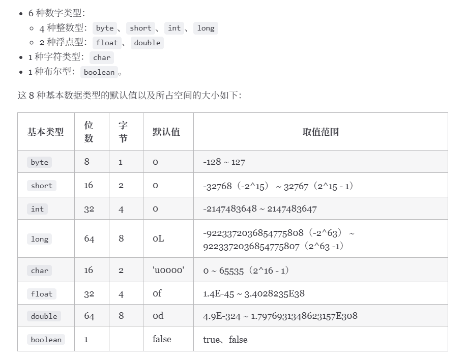
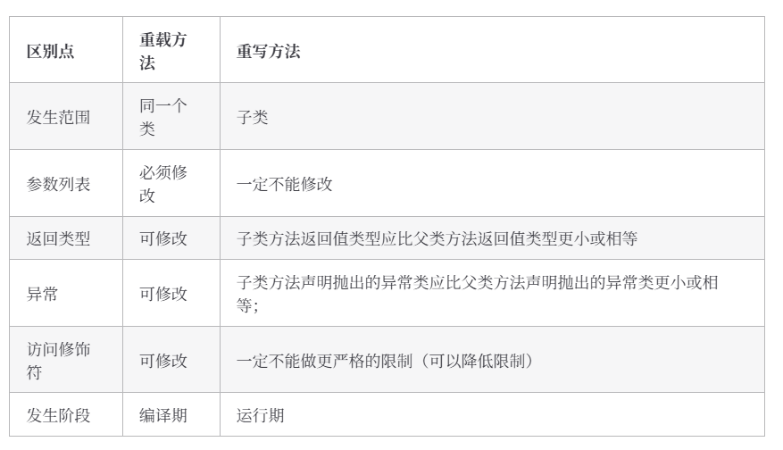
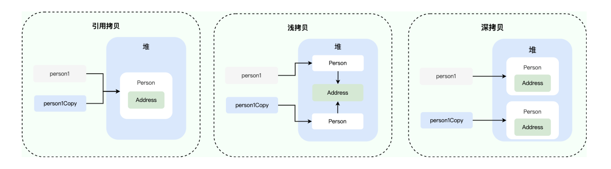
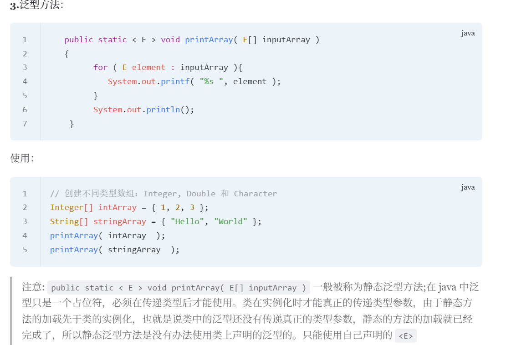
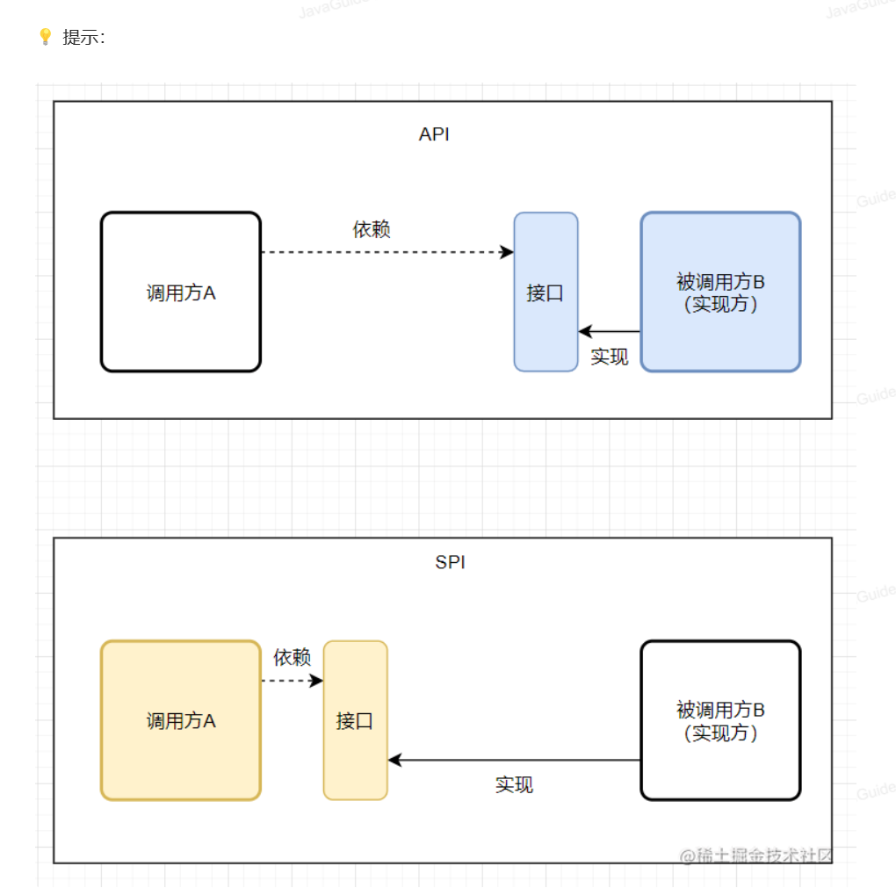

# Java基础
## Java中有8种数据类型
1. 8种数据类型

2. 包装类型的常量池技术：
    - Integer、Long、Short、Byte：缓存-128~127
    - Character：0~127
    - 例如：内部静态类 IntegerCache:
        - 在类加载时，预先生成一个静态数组，缓存指定范围内的Integer对象。
        - 自动装箱触发缓存：当通过自动装箱创建对象时，会优先从IntegerCache中获取已缓存的实例。
    - 可以通过JVM参数扩展Integr缓存的上限（其他包装类不支持）：`-XX:AutoBoxCacheMax=500`
    - 当使用 **==** 比较对象时，仅当值在缓存范围内才会返回true。建议始终用equals（）比较
    - 与字符串常量池的区别：字符串常量池时JVM全局级别的设计，存储在堆内存的特定区域，而包装类常量池是类级别的静态数据，在类加载时预生成对象，二者实现机制不同。

3. 自动装箱与拆箱的原理
    - 装箱：调用了包装类的valueOf()方法；
    - 拆箱：调用xxxValue()方法；
    - NPE(NullPointException)空指针异常场景：
        - 数据库的查询结果可能时null，因为自动拆箱，用基本数据类型接收有NPE风险
        - 三目运算符使用不当会导致诡异的NPE异常：
            1. 表达式1或表达式2其中有一个为基本数据类型，另外一个为包装类型，包装类型会拆箱，这时候包装类型若为null，就会发生NPE问题
            2. 表达式1和表达式2类型不一致，会强制拆箱升级为范围更大的那个类型

## 面向对象
1. String、StringBuffer和StringBuilder的区别是什么？String为什么是不可变的？
    - 可变性：
        - String是不可变的
        - StringBuffer和StringBuilder都继承子AbstractStringBuilder类，在 AbstractStringBuilder 中也是使用字符数组保存字符串，不过没有使用 final 和 private 关键字修饰，最关键的是这个 AbstractStringBuilder 类还提供了很多修改字符串的方法比如 expandCapacity、append、insert、indexOf 方法。
    - 线程安全性：
        - String中的对象是不可变的，可以理解为常量，线程安全。
        - StringBuffer对方法加了同步锁或者对调用的方法加了同步锁，所以线程安全。
        - StringBuilder没有对方法加同步锁，所以非线程安全。
    - 性能
        - 每次对String类型改变时，都是生成一个新的String对象，然后将指针指向新的String对象。
        - StringBuffer对对象本身进行操作，StringBuilder提升10%-15%左右性能，但线程不安全
    - String不可变的原因：
        - 保存字符串的数组被final修饰且为私有，并且String类没有提供/暴露修改这个字符串的方法。
        - String类被final修饰导致其不能被继承，进而避免了子类破坏String不可变。

2. 重载和重写的区别
    - 重载是在同一类中（或者父类和子类中），可以有多个方法名相同的方法，可以改变参数列表，改变返回值，改变访问修饰符。
    - 重写是在子类中，对继承于父类的方法的实现过程进行重写。
        - 方法名，参数列表必须相同，子类方法返回值类型应比父类的更小或者相等（若是void和基本数据类型，则不可修改，若是引用类型，可以返回该引用类型的子类），抛出的异常返回小于等于父类，访问修饰符范围大于等于父类
        - 若父类方法访问修饰符为private/final/static则子类就不能重写，但是被static修饰的方法能够被再次声明。
        - 构造方法无法被重写。
    - 两同两小一大
    

3. ==和equals的区别
    - **==** 的作用效果
        - 基本数据类型：比较值
        - 引用数据类型：比较对象的内存地址
    - **equals()**
        - 无法判断基本数据类型的变量，只能用来判断两个对象是否相等
        - 类未重写equals():等价于通过“==”比较两个对象，比较对象的内存地址
        - 类重写：比较两个对象中的属性是否相等

4. 深拷贝和浅拷贝的区别
    - 浅拷贝：在堆上创建一个新的对象（与引用拷贝的区别），对象内部的引用类型对象，直接拷贝引用地址；
    - 深拷贝：完全复制整个对象，包括对象包含的内部对象
    - 引用拷贝：两个不用的引用指向同一个对象
    

5. 接口和抽象类共同点和区别
    - 共同点： 
        - 实例化：接口和抽象类都不能实例化，必须被实现（接口）或继承（抽象类）后才能创建具体的对象。
        - 抽象方法：接口和抽象类都可以有抽象方法。抽象方法没有方法体，必须在子类或实现类中实现。
    - 区别：
        - 设计目的：接口主要用于对类的行为进行约束，实现某个接口就具有了对应的行为。抽象类主要用于代码复用，强调所属关系。
        - 单继承，多实现。
        - 接口中成员变量只能是public static final类型的，不能被修改且必须有初始值。抽象类的成员变量可以有任何修饰符， 可以在子类中被重新定义或赋值。
        - 方法：
            - Java8之前，接口中默认方法是public abstract，只能有方法声明；
            - Java8中，可以在接口中定义default方法和static方法；
            - Java9起，接口可以包含private方法。
            - 抽象类可以包含抽象方法和非抽象方法。非抽象方法有具体实现，可以直接在抽象类中使用或在子类中重写。

## 反射注解泛型
1. 反射
    - 框架的底层原理，赋予了我们在运行时分析类以及执行类中方法的能力。通过反射可以获取任意一个类的所有属性和方法，还可以调用这些方法和属性。
    - 反射让我们的代码更加灵活，为各种框架实现开箱即用提供了帮助。
    - 反射安全问题：无视泛型参数的安全检查（泛型参数的安全检查发生在编译时）。
    - 反射的性能差一点，但是对框架来说影响不大。
    - Spring/SpringBoot、MyBatis等框架中大量使用了反射。
        - 这些框架中大量使用了动态代理，而动态代理的实现也依赖反射。
        - 注解也用到了反射：基于反射分析类，获取到类/属性/方法/方法参数上的注解

2. 注解：Java5引入，一种特殊的注释，用于修饰类、方法或者变量，提供某些信息供程序在编译或运行时使用，本质是一个继承了Annotaion的特殊接口。
    - 常见的解析方法：编译期直接扫描，运行期通过反射处理；

3. 泛型：使用泛型参数，可以提高代码的可读性以及稳定性。编译器可以对泛型参数进行检测，并且通过泛型参数可以指定传入的对象类型。
    - 泛型的使用方式：
        - 泛型类：实例化泛型类的时候指定T的具体类型；
        - 泛型接口：实现接口时，可以指定也可以不指定泛型；
        - 泛型方法：

## SPI
1. SPI是服务提供者的接口，专门提供给服务提供者或者扩展框架功能的开发者去使用的一个接口。
    - SPI将服务接口和具体的服务实现分离开来，将服务调用方和服务实现者解耦，提升程序的扩展性、可维护性。修改或者替换服务实现并不需要修改调用方。
    - API和SPI的区别：

## I/O
1. 为什么要分字符流和字节流：
    - 字符流是由Java虚拟机将字节转换得到的，这个过程还算比较耗时；
    - 如果我们不知道编码类型，使用字节流的过程容易出现乱码问题；

2. 设计模式
    - 装饰器模式:可以在不改变原有对象的情况下拓展其功能。
        - 通过组合替代继承来扩展原始类的功能；
        - 可以对原始类嵌套使用多个装饰器，一层一层嵌套
        - 装饰器类需要和原始类继承相同的抽象类或者实现相同的接口
    - 适配器模式：主要用于接口互不兼容的类的协调工作
        - 适配者：适配器模式中存在被适配的对象或者类称为适配者；
        - 适配器：作用于适配者的对象或者类称为适配器。
            - 适配器分为对象适配器和类适配器。类适配器使用继承关系来实现，对象适配器使用组合关系来实现。
    - **装饰器模式**更侧重于动态地增强原始类的功能，装饰器类需要跟原始类继承相同的抽象类或者实现相同的接口。并且装饰器模式支持对原始类嵌套使用多个装饰器。
    - **适配器模式**更侧重于让接口不兼容而不能交互的类可以一起工作。
    - 工厂模式：创建对象，NIO中大量用到了工厂模式。
    - 观察者模式：NIO中的文件目录监听服务使用到了观察者模式。
        -  NIO中的文件目录监听服务基于WatchService接口和Watchable接口。WatchService属于观察者，Watchable属于被观察者。
        - Watchable接口定义了一个用于将对象注册到Wacthable（监控服务）并绑定监听事件的方法register。
        - WatchService用于监听文件目录的变化，同一个WatchService对象能够监听多个文件目录。
        - WatchService内部是通过一个daemon thread（守护线程）采用定期轮询的方式来检测文件的变化。

3. BIO、NIO、AIO
    - BIO（Blocking I/O）：同步阻塞IO模型。应用程序发起read调用后，会一直阻塞，直到内核把数据拷贝到用户空间。
    - NIO(Non-Blocking/New I/O):面向缓冲的，基于通道的I/O操作方法，适合高负载、高并发的应用。
        - 同步非阻塞IO模型：应用程序会一直发起read调用，等待数据从内核空间拷贝到用户空间的这段时间，线程依旧是阻塞的。相比同步阻塞I/O模型，通过轮询操作，避免了一直阻塞。但同样存在问题：**应用程序不断进行I/O系统调用轮询数据是否已经准备好的过程是十分消耗CPU资源的**
        - I/O多路复用模型：线程首先发起select调用，询问内核数据是否准备好，等内核把数据准备好，用户线程再发起read调用。read调用过程（数据从内核空间->用户空间）还是阻塞的。
            - select调用：支持一次查询多个系统调用的可用状态。
            - epoll调用
            - 减少了无效的系统调用，减少了对CPU资源的消耗。
            - 选择器selector（多路复用器），通过它一个线程可以管理多个客户端连接。当客户端数据到了之后，才会为其服务。
    - AIO(Asynchronous I/O):异步IO模型。基于事件和回调机制实现，也就是应用操作之后会直接返回，不会阻塞在那里，当后台处理完成，操作系统会通知相应的线程进行后续的操作。

