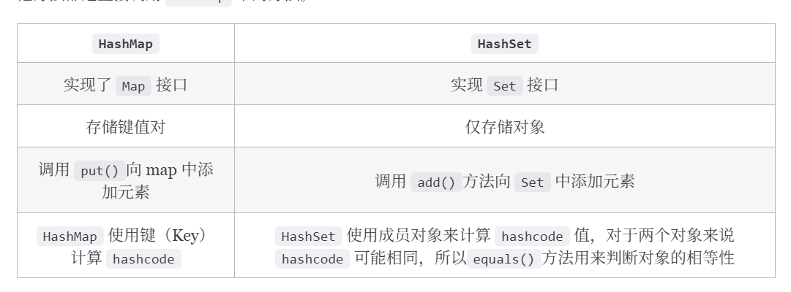
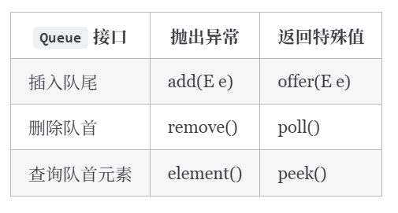
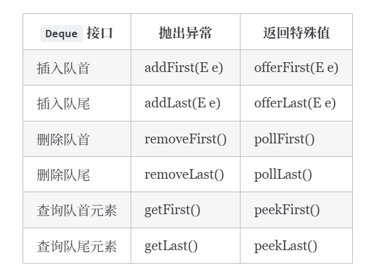
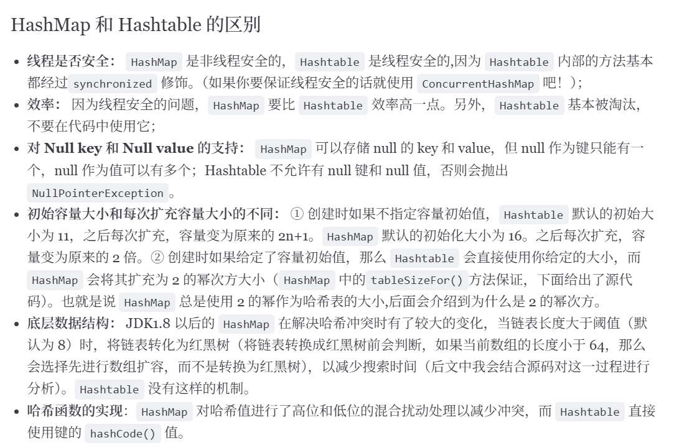
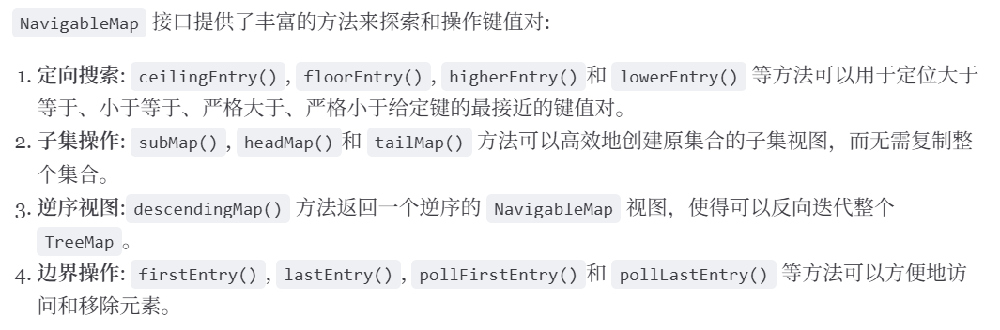
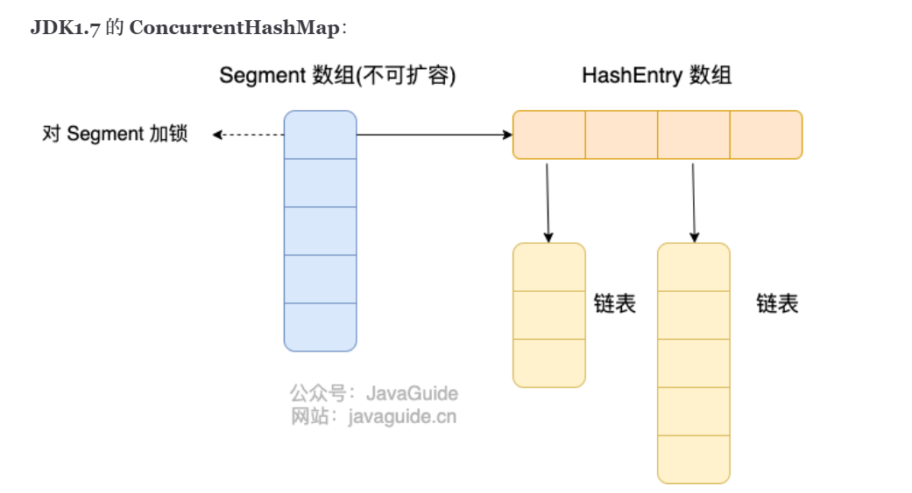
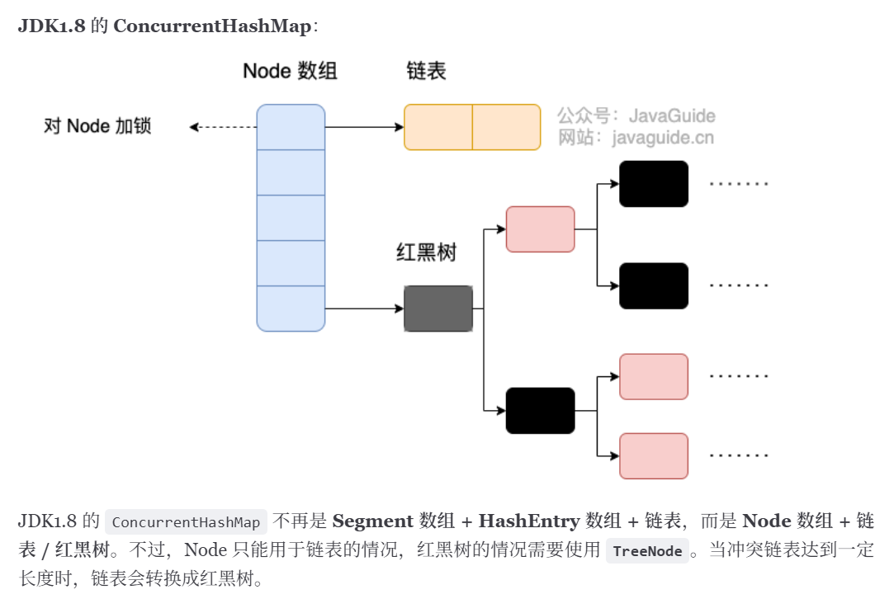
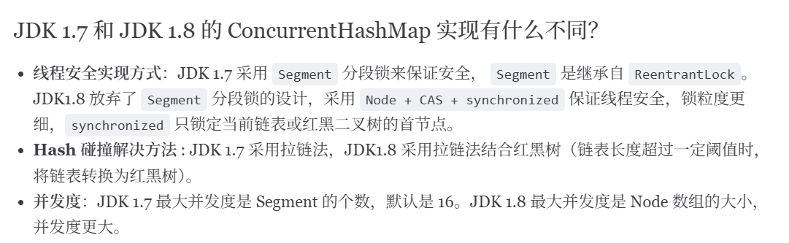

# Java集合
## 基础
1. List, Set, Map三者区别
    - 有序：List中的是有序的，Queue中的也是有序的，
    - 重复性： Set中的元素是不可重复的， Map中的key也是不可重复的
    - 存储元素类型：Map中使用键值对存储

2. List数据结构
    - ArrayList:Object[]数组
    - Vector: Object[]数组
    - LinkedList: 双向链表（jdk1.6前是循环链表，1.7取消了循环）
    
    - ArrayList、LinkedList和Vector的区别
        - ArrayList是List的主要实现类，底层使用object[]存储，适用于频繁的查找工作，线程不安全；实现类RandomAccess接口，支持快速随机访问
        - Vector是List的古老实现类，底层使用object[]存储，**线程安全**，使用synchronized关键字进行同步处理（和Stack一样，Stack继承自Vector）。
        - LinkedList也线程不安全，内存占用上LinkedList每个节点都需要额外的空间存放直接前驱和直接后继
    - ArrayList扩容机制：以无参数构造方法创建ArrayList时，实际上初始化赋值的是一个空数组。当真正对数组进行添加元素操作时，才真正分配容量。即向数组中添加第一个元素时，数组容量扩为10。
    当需要扩容时，ArrayList每次扩容之后容量会变成原来的1.5倍左右（根据奇偶）

3. Set数据结构
    - HashSet:无序唯一，基于HashMap实现，底层采用HashMap保存元素
    - LinkedHashSet：HashSet的子类，并且其内部通过LinkedHashMap实现。
    - TreeSet：有序唯一，红黑树（自平衡的排序二叉树）
    
    - 异同：
        - 都实现唯一，都线程不安全
        - 数据结构不同，hashSet底层是哈希表（基于hashMap实现）。LinkedHashSet底层数据结构是哈希表和链表，元素插入取出顺序满足FIFO。TreeSet底层是红黑树，有序。

4. Queue数据结构
    - PriorityQueue：Object[]数组来实现小顶堆，出队顺序和优先级相关的，总是优先级最高的元素先出队。
        - 利用二叉堆的数据结构来实现，底层使用可变长的数组来存储数据；
        - 通过堆元素的上浮和下沉，实现了在O(logn)的时间复杂度内插入元素和删除堆顶元素。
        - 非线程安全，且不支持NULL和non-comparable的对象。
        - 默认时小顶堆，但可以接收一个Comparator作为构造参数，来自定义元素优先级；

    - DelayQueue：PriorityQueue
    - ArrayQueue：可扩容动态双向数组
    - Queue和Deque的区别
        - Queue是单端队列，遵循先进先出（FIFO）规则，扩展了Collection接口
        - Deque是双端队列
    - ArrayQueue和LinkedList的区别：
        - 都实现了Deque接口，具有队列的功能；
        - 结构：ArrayQueue是基于可变长的数组和双指针来实现的，而LinkedList是通过链表来实现的；
        - 存储数据：ArrayQueue不支持存储NULL数据，而LinkedList支持；
        - 扩容：ArrayQueue插入时可能存在扩容过程，不过均摊后的插入操作依然为O(1)，而LinkedList无需扩容，但插入数据时需要申请新的堆空间，均摊性能相比更慢。
        - 性能：ArrayQueue>LinkedList，ArrayQueue可用来实现栈。

5. Map数据结构
    - HashMap数组+链表（1.8之前），1.8之后，当链表长度大于阈值（默认为8）（将链表转换为红黑树前会判断，如果当前数组的长度小于64，那么会先进行数组扩容，而不是转换红黑树）时，将链表转换为红黑树，以减少搜索时间。
    - LinkedHashMap：继承自HashMap，再HashMap的数据结构上，增加了一条双向链表，使得可以保持键值对的插入顺序。
    - HashTable：数组+链表，线程安全：
    - TreeMap：红黑树：相比hashMap，主要多了对集合中的元素根据键排序的能力以及对集合内元素的搜索的能力。

    - HashMap的插入的时间复杂度：
        - 计算根据要添加的键的哈希码计算在数组中的索引：无哈希冲突时间复杂度为**O(1)**;
        - 检查该位置是否为空；
        - 若为空则在该位置创建一个新的Entry存储键值对。将HashMap的修改次数加1，以便在进行迭代时发现和并发修改。
        - 若不为空，则判断键是否相同，相同则更新；
        - 若不同，则遍历链表或者红黑树来查找是否有相同的键
        - 若为链表则从头开始遍历比较键的哈希码和equals()方法 **O(K)(K为链表长度)**。
            - 若找到相同的则更新
            - 未找到，将新的插入链表头部
        - 若为红黑树：则在红黑树中查找，与上相同，若未找到插入红黑树 **O(logk)**
        - 检查链表长度是否达到阈值（默认为8）
            - 若链表长度超过阈值，且数组长度大于等于64，则将链表转化为红黑树
        - 检查负载因子（键值对数量和数组的长度的比值）是否超过阈值（默认为0.75），则需要扩容
        - 扩容操作：
            - 创建一个两倍的数组；
            - 将旧数组中的键值对重新计算哈希码并分配到新数组中的位置；
            - 更新HashMap的数组引用和阈值参数
        - 完成插入
        
    - 为什么HashMap的长度是2的幂次方
        - 位运算比取余效率高：哈希散列值计算后需要对数组长度进行取模运算，**取余（%）运算中如果除数是2的幂次方则等价于与其除数减一的与（&）操作：hash%length==hash&(length-1)**
        - 扩容时更加均匀：扩容之后，旧数组元素hash值比较均匀的情况下，新数组的元素也会被分配的比较均匀，最好的情况是会有一半在新数组的前半部分，一半在新数组后半部分。
        - 扩容机制变得简单高效：扩容后只需要检查哈希值高位的变化来决定元素的新位置，要么位置不变（高位为0），要么移到新位置（高位为1，原索引位置+原容量）。
    - ConcurrentHashMap和HashMap的区别
        - ConcurrentHashMap线程安全
            - JDK1.7时，对整个桶数组进行分割分段（segment，分段所锁）
            - 1.8时，并发使用synchronized和CAS来操作，整个看起来就是优化且线程安全的HashMap
            - 
        - 底层数据结构：1.7之前的ConcurrentHashMap底层采用分段的数组+链表

