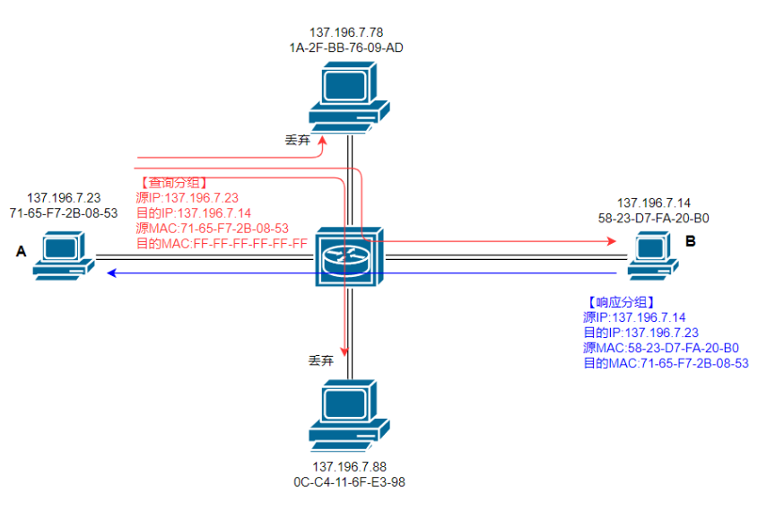
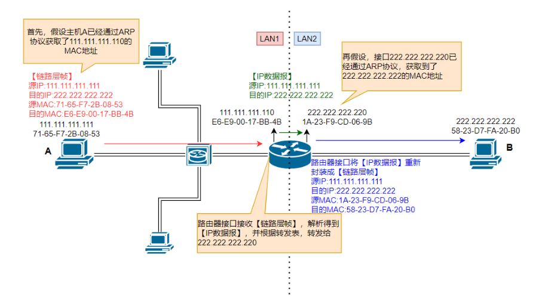
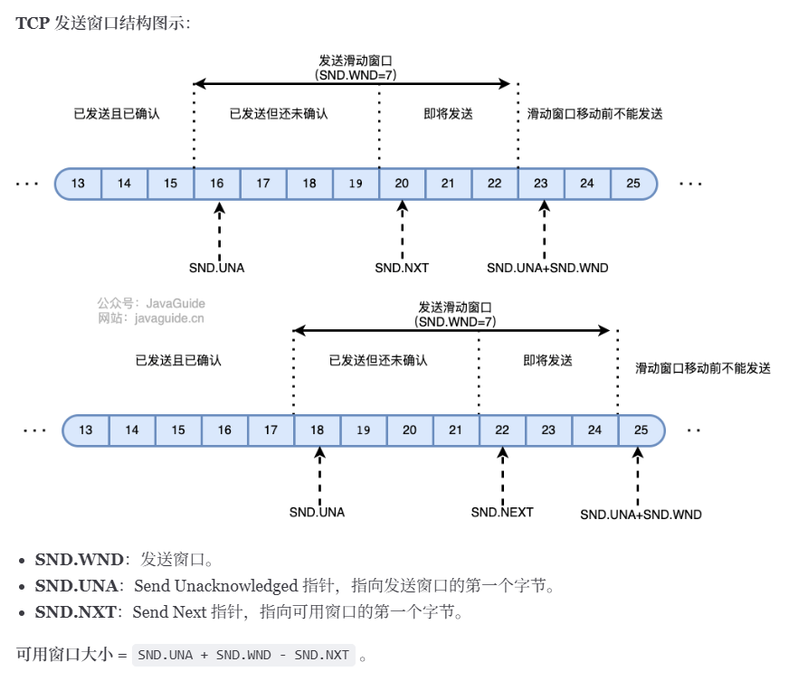
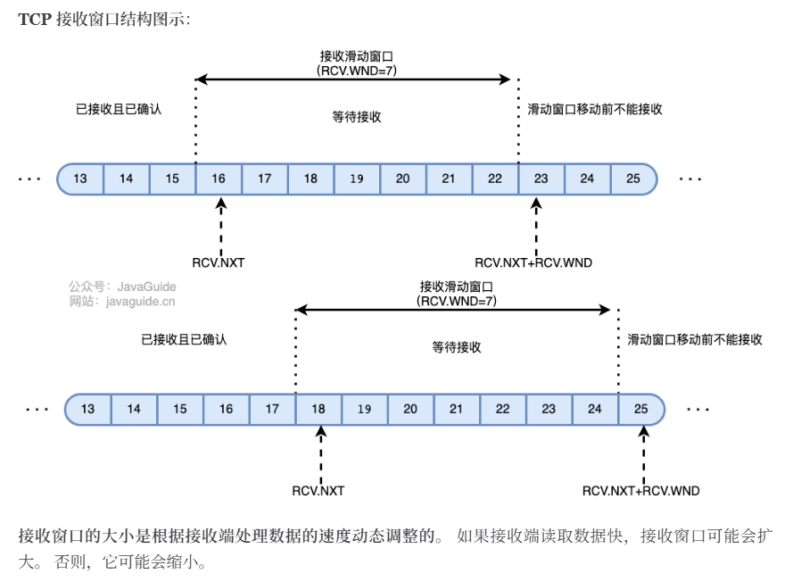
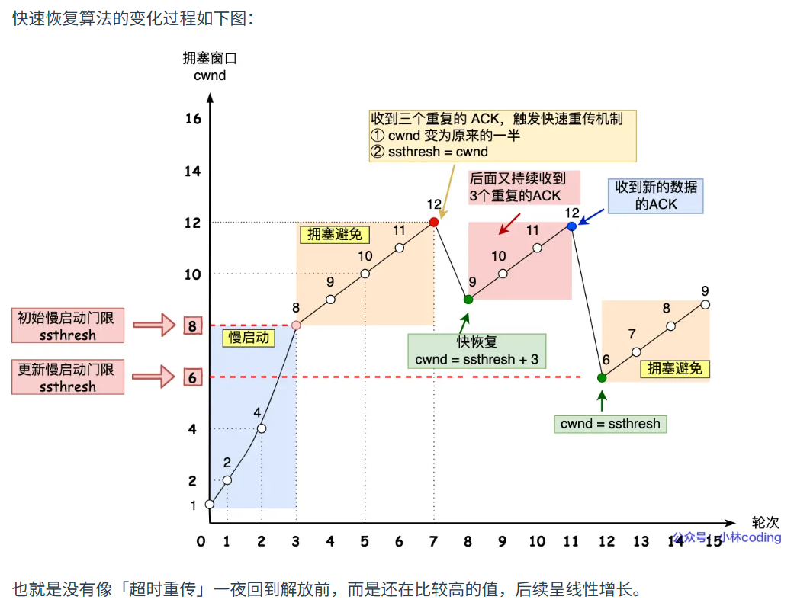
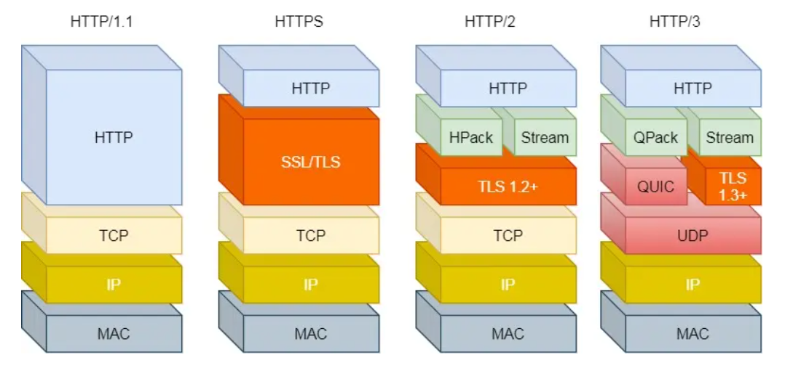
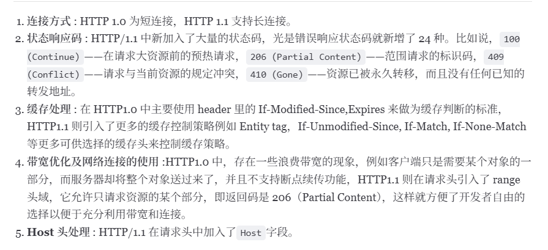
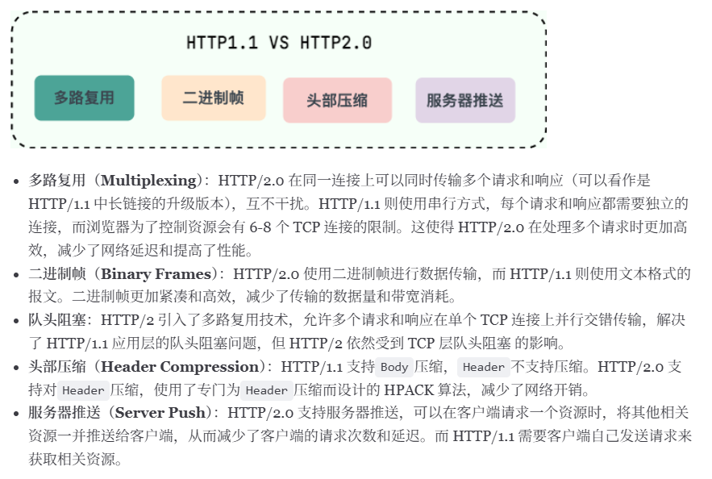
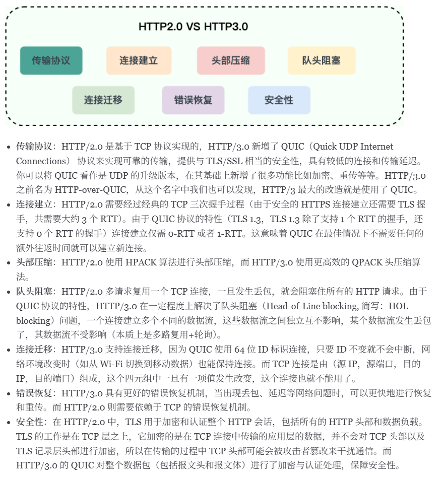
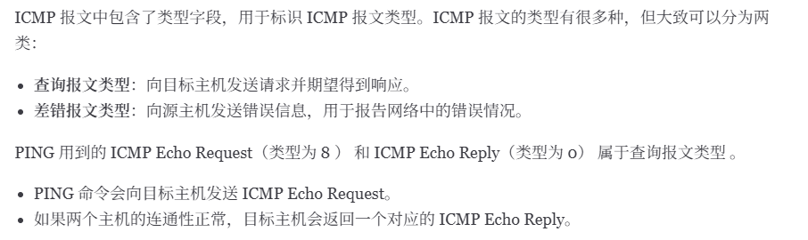

# 从输入URL到页面展示到底发生了什么
## 在浏览器中输入指定网页的URL
## 在浏览器通过DNS协议，获取域名对应的IP地址
1. DNS（Domain Name System）域名管理系统，解决域名和IP地址的映射问题，应用层协议，基于UDP协议之上，端口为53

2. DNS服务器自底向上可以分为四个：根DNS服务器、顶级域DNS服务器、权威DNS服务器、本地DNS服务器。

3. ARP协议：IP属于逻辑地址，MAC地址属于物理地址，ARP协议解决了IP地址转换MAC地址的一些问题 
    - MAC地址：FF-FF-FF-FF-FF-FF(全1)是广播地址；
    - ARP表:每个网络设备有一个ARP表,记录IP和MAC地址的映射关系 **<IP, MAC, TTL>**
    - 同一局域网内的MAC寻址：ARP表中没有时，通过广播查询分组获取MAC地址 **广播问询，单播响应**
    
    - 不同局域网内的MAC寻址：通过ARP协议找到目标路由器的本子网接口的MAC地址，将IP数据报包装成链路层帧，发送给目标路由器的本子网接口，再目标接口上解析，根据IP地址，查询转发表，将IP数据报转发到目的主机的子网接口上，重新封装成链路层帧，然后就是同一局域网的MAC寻址
    

## 浏览器根据ip地址和端口号，向目标服务器发起一个TCP连接请求
1. TCP三次握手
    - 一次握手：客户端发送带有SYN标志的数据包到服务端，带着seq=x，客户端进入SYN-SEND状态
    - 二次握手：服务端发送带有SYN+ACK标志的数据包到客户端，带着seq=y、ack=x+1,服务端进入SYN-RECV状态
    - 三次握手：客户端发送带有ACK标志的数据包到服务端，带着ack=y+1，然后客户端和服务端都进入ESTABLISHED状态，完成TCP三次握手。
    - 服务端收到客户端SYN请求时，还没有完全建立连接，将半连接状态的连接放在半连接队列里（SYN-QUEUE)。
    - 当三次握手完成后，将连接从半连接队列中移动到全连接队列（Accept Queue）。
    - 三次握手的目的是让双方都知道自己和对方的收发功能是正常的。

2. TCP四次挥手
    - 第一次挥手：客户端发送一个FIN标志的数据包到服务端，带着seq=x，用来关闭客户端到服务端的数据传送，客户端进入FIN-WAIT-1状态。
    - 第二次挥手：服务端收到FIN标志的数据包，发送一个ACK标志的数据包给客户端，带着ack=x+1,服务端进入CLOSE-WAIT状态，客户端进入FIN-WAIT-2状态。
    - 第三次挥手：服务端发送一个FIN标志的数据包，带着seq=y， 请求关闭连接，服务端进入LAST-ACK状态。
    - 第四次挥手：客户端发送ACK标志的数据包到服务端，带着seq=y+1，客户端进入TIME-WAIT状态，服务端收到ACK标志后，进入CLOSE状态，客户端在等待2MSL后依然没有收到回复，说明服务端正常关闭，客户端也可以关闭。
    - 只要四次挥手没有结束，客户端和服务端就可以继续传输数据。
    - **为什么不能将服务端发送的ACK和FIN合并起来**：因为服务端收到客户端断开连接的请求后，可能还有数据需要发送，所以先回复ACK，表示接收到了断开请求。等到数据发送完毕后再发FIN，断开服务端到客户端的数据传送。
    - **为什么第四次挥手客户端需要等2MSL再进入CLOSED状态**：第四次挥手的时候，客户端发送的ACK可能会丢失，服务端没有收到的情况下就会重发FIN，如果客户端再2MSL时间内收到了FIN，就会重新发送ACK并再次等待2MSL，防止Server没有收到ACK而不断重发FIN

3. TCP如何保证可靠传输：
    - 基于数据块传输：被分割成TCP认为最适合发送的数据块，传输给网络层，数据块被称为报文段
    - 对失序数据包重新排序以及去重：每个包都有一个序列号；
    - 校验和：TCP保持首部和数据的校验和；
    - 重传机制：
        - 计时器重传（超时重传）
        - 快速重传（基于接收端的反馈信息来引发重传）
        - SACK（快速重传基础上，返回最近收到的报文段的序列范围）
        - D-SACK（在SACK的基础上，额外携带信息，告知发送发有哪些数据包自己重复接受了）
    - 流量控制：可变大小的滑动窗口协议
        - 发送窗口：
        - 接收窗口：
    - 拥塞控制：网络的拥塞程度由拥塞窗口 **（cwnd）** 表示，是发送方根据网络状况自己维护的一个值，表示发送方认为可以在网络中传输的数据量。发送方发送数据的大小是滑动窗口和拥塞窗口的最小值，保证既不会超出接收方的接受能力，也不会造成网络的过度拥塞。
        - 慢开始：cwnd加倍（每收到一个ACK，cwnd+1）；
        - 拥塞避免：每一个往返时间RTT就把cwnd加1（每收到一个ACK，cwnd+1/cwnd）；
        - 超时重传：慢启动门限**ssthresh**（达到ssthresh，进入拥塞避免）设为cwnd/2，初始化cwnd
        - 快重传和快恢复 **（FRR）** ：收到三个重复的ACK
            - 快速重传：cwnd=cwnd/2，ssthresh=cwnd
            - 快速恢复：
                - cwnd=ssthresh+3;
                - 重传丢失的数据包；
                - 再收到重复ACK，cwnd+1；
                - 收到新数据ACK，cwnd=ssthresh，进入拥塞避免
        

## 浏览器在TCP连接上，向服务器发送一个HTTP（端口号80）请求报文，请求获取网页的内容
1. HTTPS（端口号443）:使用非对称加密生成一个用于对称加密的密钥；

2. 带有CA证书的公钥传输机制：
    - 设有服务器S，客户端C，第三方信赖机构CA。
    - S信任CA，CA知道S的公钥，CA向S颁发证书。并附上CA私钥对消息摘要 **（采用散列技术生成）** 的加密签名。
    - S获得CA颁发的证书，将证书传递给C。
    - C获得了S的证书，信任CA并知晓CA公钥，使用CA公钥对证书上的签名解密，同时对消息进行散列处理，得到摘要。比较摘要，验证S证书的真实性。
    - 如果C验证S证书是真实的，则信任S的公钥（在S证书中）

3. RSA四次握手
    - `Client Hello` 客户端向服务器发送随机数C、客户端TLS版本号、密码套件列表；
    - `Server Hello`服务器确认TLS版本号是否支持，服务器向客户端发送一个随机数S、确认TLS版本号、使用的密码套件（RSA） **密钥交换算法+签名算法+对称加密算法+摘要算法** 
    - `Server Certificate`服务器向客户端发送证书
    - `Server Hello Down` 服务端发送完毕
    - 客户端验证证书：如果证书验证失败，客户端会中断连接。如果验证通过，客户端会生成一个用于会话的对称密钥。
    - `Client Key Exchange` 客户端生成一个新的随机数pre-master，用服务器的公钥加密，发送给服务器。
    - 服务端和客户端都有三个随机数Client Random、Server Random、pre-master，根据三个数生成会话密钥Master Secret
    - `Change Cipher Spec` 客户端告知服务端使用对称加密方式发送消息
    - `Encrypted Handshake Message(Finished)` 客户端对之前的消息做个摘要，再用会话密钥master secret 加密， 让服务器进行验证，验证加密通信是否可用、之前握手信息是否有被中途篡改。
    - `Change Cipher Spec` `Encrypted Handshake Message(Finished)`服务器发送

4. HTTP/1.0、HTTP/1.1、HTTP/2、HTTP/3对比
    - 
    - HTTP/1.0是短连接，HTTP/1.1优化为默认长连接：`connection: Keep-alive/close`, HTTP协议的长连接和短连接本质上是TCP协议的长连接和短连接。
    - HTTP/1.1在请求头中加入了Host字段
    - 1.0 vs 1.1 
    - 1.1 vs 2.0 
    - 2.0 vs 3.0 

5. Ping命令的工作原理
    - ping基于网络层的ICMP，其主要原理就是通过在网络上发送和接受ICMP报文实现的
    

## 服务器在收到HTTP请求报文后，处理请求，并返回HTTP响应报文给浏览器
## 浏览器收到HTTP响应报文后，解析响应体重的HTML代码，渲染网页的结构和样式，同时根据HTML中的其他资源的URL（如图片、CSS、JS等），再次发起HTTP请求，获取这些资源的内容，直到网页完全加载显示。
## 浏览器在不需要和服务器通信时，可以主动关闭TCP连接，或者等待服务器的关闭请求
