# 通过设备-边缘-云协作加速DNN模型训练                                                             
## 项目概述： 
自主开发DNN模型的分布式训练框架 ，提高计算资源的使用率 ，优化DNN模型的训练效率；
## 项目成果：
搭建了DEC分布式学习框架 ，通过使用并行学习技术 ，在数据和模型层面分别进行分割 ，分配到设备 、边缘 、云端 进行训练 。使用整数线性规划 ，开发DEC算法 ，找到最佳的数据和模型分割点 。借助Docker工具 ，将完整框架打包 ，便于不同环境部署。

## 技术栈：
Python语言 、Tensorflow框架 、Docker 、Pycharm等开发工具。

# EquipFlow(设备通)                                                            
## 项目概述：
采用了MVC架构 ，使用springboot+Redis+mybatis-plus框架搭建网站 ，实现用户和领导两个功能模块 ，分别是用户的设备处理 事务 、信息统计 、登录登出 ，以及领导端的对设备审批事务 、查询设备和人员管理功能。
## 个人职责：
1. 针对高频访问的设备查询接口，使用多级缓存（Caffeine本地缓存 + Redis分布式缓存），设计了TTL分层过期策略，本地缓存降低Redis压力，缓存击穿问题通过‘逻辑过期+互斥锁’方案解决；
    - Caffeine本地缓存：免去分布式缓存的网络开销
        - 场景：高频访问，但数据变更较少的接口（设备分类列表，部门信息）
        - 先注入Caffeine本地缓存（`Caffeine.newBuilder().build()`）。
        - 原理：
            - TinyLFU:CMS算法解决LFU的维护频率信息统计的开销较大的问题（类似布隆过滤器， 4bit存储一个频率，<15则+1）
            - W-TinyLFU: Windows Cache 占1%， Main Cache占99%（Protected区占80%， probation区占20%）
            - Probation 区最旧的缓存项(队头)被称为 Victim(受害者)。从 Window Cache 或 ProtectedCache 移出准备写入 Probation 区的缓存项称为 Candidate(候选者)。
            - 比较两者频率大小，如果 Candidate 缓存项的访问频率大于 Victim 缓存项的访问频率，则淘汰掉Victim。如果 Candidate 小于或等于 Victim 的频率目 Candidate 的频率小于等于 5，就淘汰掉Candidate;否则，在 Candidate 和 Victim 两者之中随机地淘汰一个。
        - 读写缓存（Read Buffer, Write Buffer）借鉴了数据库的WAL（Write-Ahead-Logging）思想,记录状态变动日志，读数据状态放RingBuffer，写数据状态变更信息放MpscGrowableArrayQueue阻塞队列，防止Ringbuffer套圈丢失
        - 异步数据清理：异步处理数据淘汰，缓存实际大小可能会超出最大容量限制
        - 时间轮：实现过期策略，适合定时任务（参考手表）
        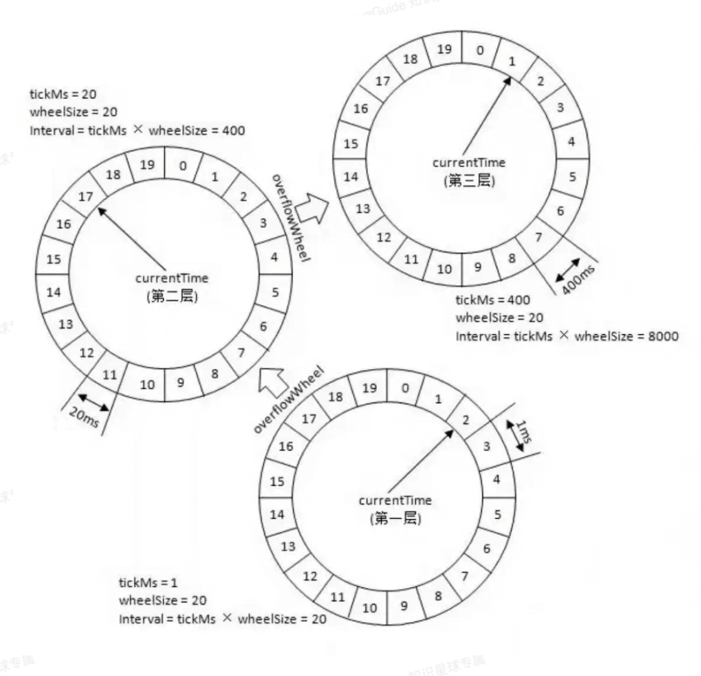
        - 业务逻辑：
            1. 先读本地缓存，本地未命中，查询Redis；
            2. 读取Redis，未命中查询数据库并回填Redis（长TTL）；
            3. 回填本地缓存(短TTL)  
  
    - Redis分布式缓存：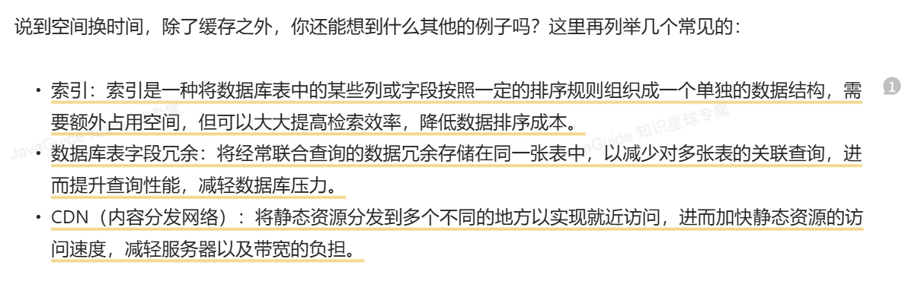
        - Nginx负载均衡
        - 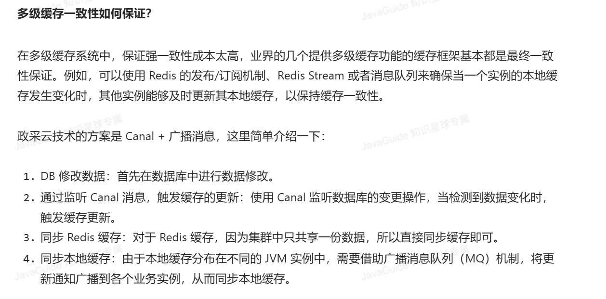
        - 旁路缓存
        - RDB数据快照:`save`  `bgsave`
        - `bgsave` 异步，fork主进程得到子进程，子线程进行读取数据写入RDB，主线程写时复制（copy-on-write）
        - `save 60 1000` 代表60秒内至少执行1000次修改则触发RDB
        - AOF 可以看作是命令日志文件 `appendfsync always/everysec/no`
        - `bgrewriteaof` AOF文件重写 异步
        - 主从集群 `slaveof <masterip> <masterport>`
        - 数据同步 `Replication id`和 `offset` 全量同步（第一次同步） 增量同步
        - 优化：
            - 无磁盘复制 `repl-diskless-sync yes`
            - Redis单节点内存占用不要太大
            - 提高`repl_backlog`的大小，减少全量同步
            - 限制一个master上的slave节点数量，可以采用主-从-从链式结构

        
        - 哨兵 ：26379端口
            - 心跳机制：主观下线（规定时间）/客观下线（规定数量（quorum：最好超过sentinel实例数量的一半））
                - 多个sentinel节点，容错性增强（投票判断，避免网络等因素）、高可用性（建议将sentinel配置程单数>=3）

            - 选举新master: 判断断开时间长短（超过`down-after-milliseconds*10`则排除）（以下优先级依次降低）
                - `slave-priority`
                - `offset`
                - `id`越小优先级越高
            
            - 选举新sentinel Leader： Raft算法

            - 故障转移： 对新的master发送`slaveof no one`， 所有节点执行slaveof新master， 修改故障节点配置，添加slaveof新master

            - 防止脑裂（分布式节点间数据不一致）：
                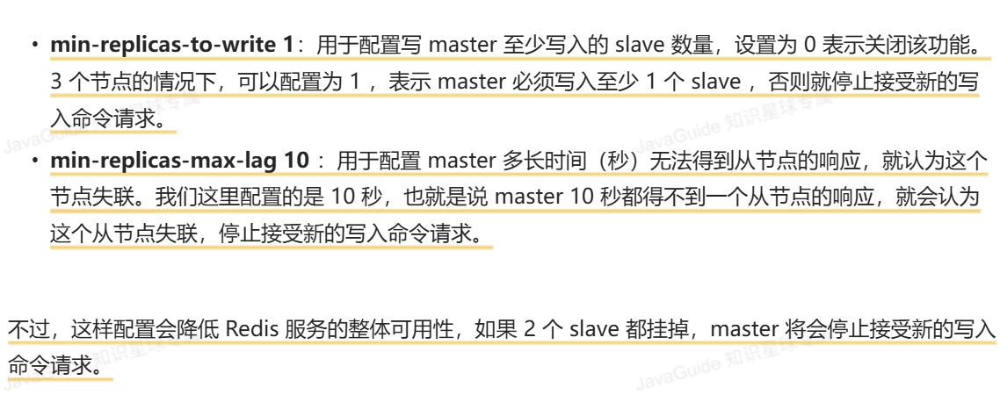

            - RedisTemplate配置主从读写分离：
                - `MASTER`优先主，
                - `MASTER_PREFERRED`优先主，主不可用读replica，
                - `REPLICA`优先从，
                - `REPLICA_PREFERRED`从不可用读master

        - 分片集群(Redis Cluster) ：部署多台Redis主节点master，节点间平等无主从之分，同时对外提供读/写服务。缓存的数据库均分再这些Redis实例上，客户端的请求通过路由规则转发到目标master上 **（各节点间基于Gossip通信）**，每个master为保证高可用，可以通过主从复制配置一个或多个从节点slave。**内置Sentinel机制**

            - 散列插槽：16384个插槽分配到不同的实例，key的有效部分求哈希

            - 集群伸缩：动态扩容和缩容
                - `add-node`：添加节点到集群，默认master， 
                - `reshard`重新分配插槽
            - 数据迁移： `cluster failover`命令可以手动让集群中的某个master宕机，切换到执行cluster failover命令的这个slave：
                - force：省略offset一致性校验
                - takeover：直接标记自己为master，广播故障转移的结果，忽略master状态，忽略数据一致性
                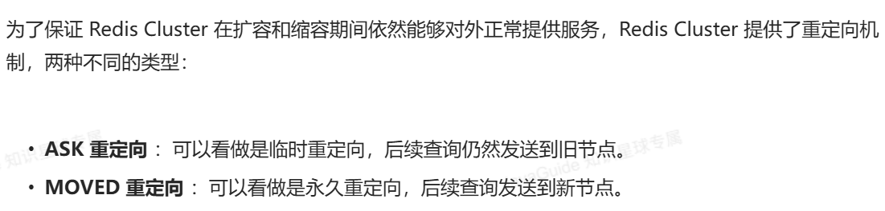
            - 基于Gossip协议通信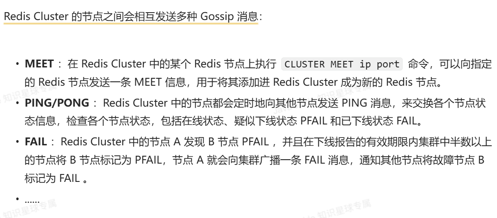
            - RedisTemplate访问分片集群:     

2. 针对审批流程状态：采用 RabbitMQ 实现消息队列，异步处理审批结果通知，使用ACK机制保证消息可靠性；
    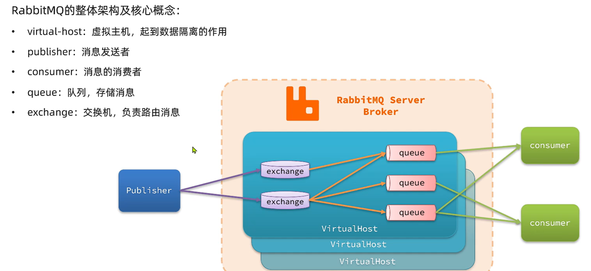
    - 耦合度低，拓展性强
    - 异步调用，无需等待，性能号
        - Broker
    - 故障隔离，下游服务故障不影响上游业务
    - 缓存消息，流量削峰填谷
    - SpringAMQP： 
        - AMQP协议:用于在应用程序之间传递业务消息的开放标准。该协议与语言和平台无关，更符合微服务中独立性的要求；
        - Spring AMQP 是一套API规范，底层实现是spring-rabbit，基础抽象是spring-amqp
        - work模型：
            - 消费组，多个消费者加入一个work队列，抢夺消息，默认轮询， 加`prefetch：1`每次只能获取一条消息，处理完才能获取下一条
            - 在一个队列上绑定多个消费者，提高消息的消费速度
            - 同一条消息只会被一个消费者处理
        - exchange交换机：
            - Fanout:广播
                - 一个交换机对应多个队列，每个队列收到相同消息，一个队列可以对应多个消费者
            - Direct:定向 会将接收到的消息根据规则路由到指定的Queue
                - 每个Queue与Exchange设置一个BindingKey
                - 发布者发送消息时，指定消息的RoutingKey
            - Topic：话题
                - routingKey可以是多个单词的列表，并且以.分割
                - Queue与Exchange指定BindingKey时可以使用通配符
                    - #：代指0个或多个单词
                    - *：代指一个单词
        - 声明队列和交换机 基于注解绑定，在消费者方法上`@RabbitListener, @QueueBinding, @Queue, @Exchange`
        - 自定义消息转换器 `MessageConverter`使用jackson序列化，不要用jdk自己的序列化
    - 生产者可靠性
        - 生产者重连 在yml中配置 阻塞式重试
        - 生产者确认：收到nack/ack回执，但大部分情况无需开启生产者确认机制，需要额外网络和系统资源开销
        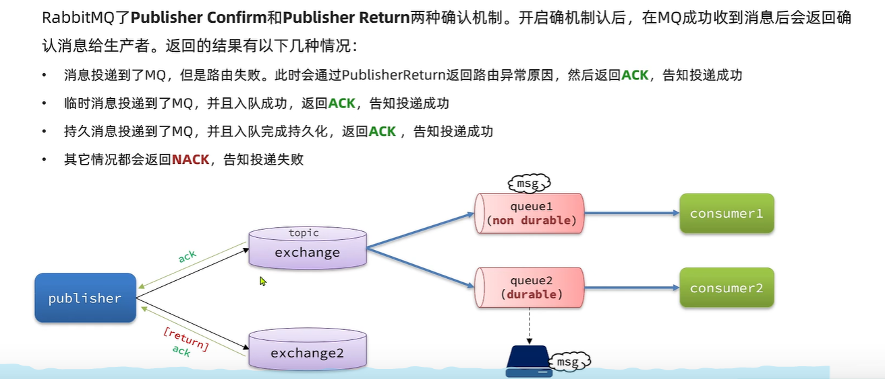
            - `Publisher Confirm`：`none`：关闭confirm机制，`simple`:同步阻塞等待MQ的回执消息， `correlated`：MQ异步回调方式返回回执消息
            - `publisher Return` 路由失败，返回路由异常原因， 返回ACK，告知投递成功
    - MQ的可靠性
        - 数据持久化：交换机持久化`Durable`、队列持久化`Durable`、消息持久化`Delivery-mode: 2`
        - lazy Queue（惰性队列）：消息存入磁盘而非内存 
    - 消费者可靠性
        - 消费者确认机制:消费者处理消息结束后，应该向RabbitMQ发送回执
            - ack：成功处理，RabbitMQ从队列中删除消息
            - nack：处理失败，RabbitMQ重发
            - reject：消息处理失败并拒绝该消息，RabbitMQ从队列中删除
            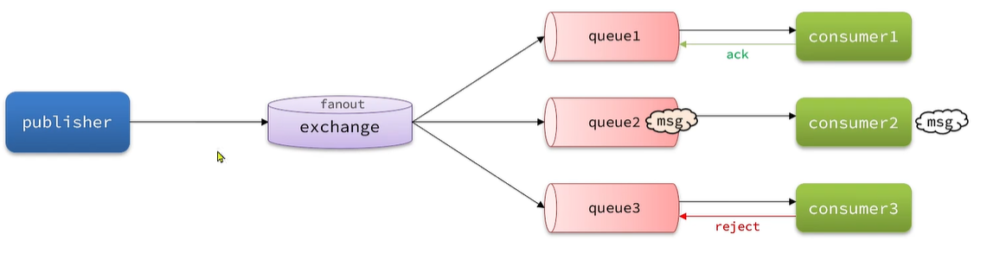
            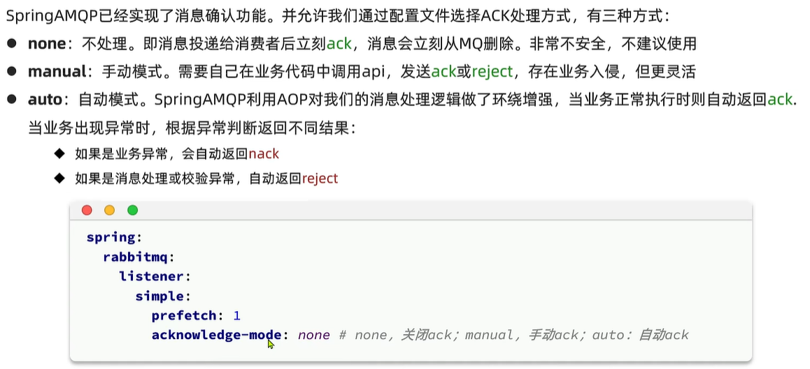
        
        - 失败重试机制： 
            - retry机制，本地重试，而不是无限制的requeue到mq队列
            - MessageRecover接口：多次重试失败后，调用该接口
            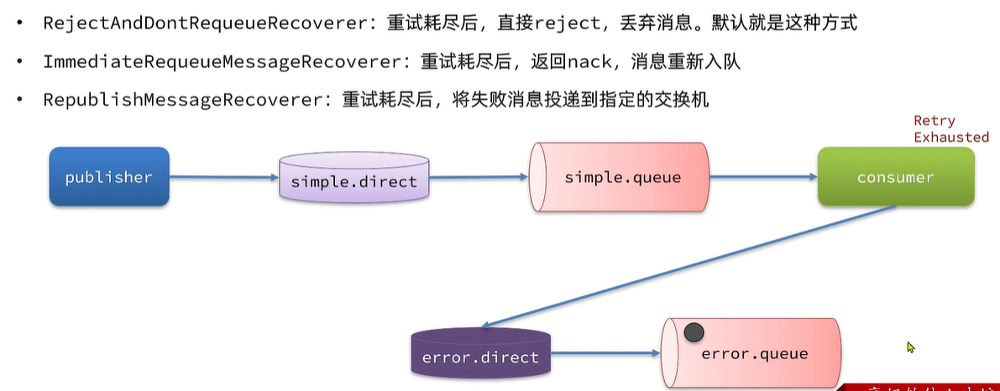
        
        - 业务幂等性：一个业务执行一次或者多次对业务状态的影响是一致的
            - 唯一消息id：利用id区分是否是重复消息
            - 结合业务逻辑，基于业务本身做判断
    
    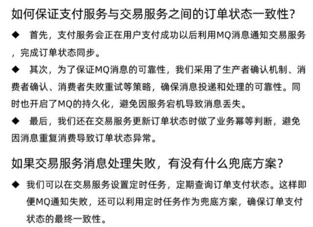
    - 延迟消息：生产者发送消息时指定一个时间，消费者不会理科收到消息，而是在指定时间之后才收到消息。
    - 延时任务：设置在一定时间之后才执行的任务
        - 死信交换机：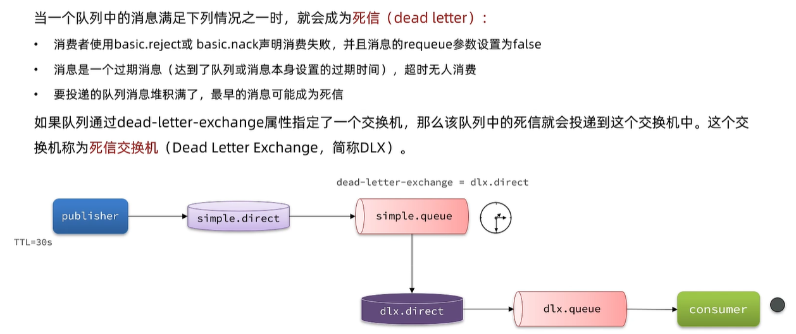
        - 延迟消息插件： 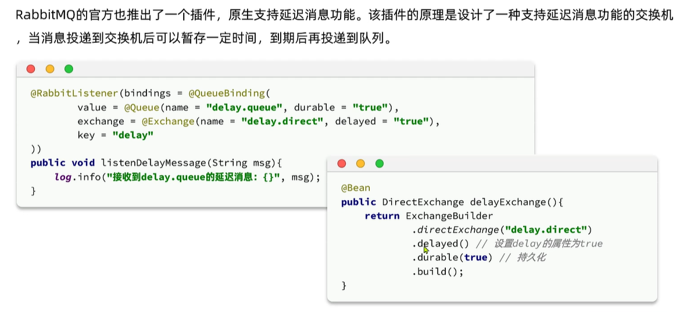
    

3. 设备分页查询：结合PageHelper 动态分页 + 索引优化（覆盖索引）+ 深分页性能优化；
    - 动态分页
        - 依赖集成：在pom.xml中引入PageHelper依赖
        - 分页逻辑调用：在Service层通过PageHelper.startPage()触发分页
        `PageHelper.startPage(pageNum, pageSize);`pageNum:当前页码，pageSize:每页展示记录数
        `List<Device> devices = deviceMapper.selectByStatus(status);` 执行查询（自动追加LIMIT）
        - Controller返回分页数据
        - 技术价值：PageHelper自动识别分页参数，适配前端多样化分页需求（页码跳转、排序变化）。
    - 覆盖索引优化（数据库层）
        - 索引设计：针对高频的status筛选+create_time排序场景，创建联合索引
            ```SQL
            ALTER TABLE tb_device 
            ADD INDEX idx_status_createtime (status, create_time DESC);
            ```
        - SQL 优化： 确保查询字段、条件、排序、均被索引覆盖：
            ```xml
            <!-- MyBatis映射文件 -->
            <select id="selectByStatus" resultType="Device">
                SELECT id, name, status, create_time 
                FROM tb_device
                WHERE status = #{status}
                ORDER BY create_time DESC  <!-- 命中索引排序 -->
            </select>
            ```
        - 通过`EXPLAIN`可见`Extra: Using index`，避免回表查询
        - 技术价值：查询性能提升，覆盖索引减少70%的磁盘IO，实测10万数据量下分页响应从120ms降至35ms。
    - 深分页性能优化：
        - 传统分页瓶颈 需扫描前100万行
        - 游标分页优化 通过记录上一页末尾记录的create_time和id
        - 索引优化验证：通过`EXPLAIN`分析执行计划，确保：
            - type: range（索引范围扫描）
            - Extra: Using where; Using index
        - 技术价值： 游标分页使1000页后的查询延迟稳定在50ms内，避免`OFFSET`线性增长问题。
    - 技术组合价值：
        - 用户体验：前100页支持自由跳转，深层数据流畅滚动
        - 资源节约：减少80%的深分页数据库CPU消耗（实测从1200QPS提升至5000QPS）

4. 登录状态：采用Redis实现短信验证登录，实现登录校验拦截器。分布式session？


## 技术栈：
Java 、Springboots 、Redis等


# 安徽天立泰科技股份有限公司 Java 2019.07-2019.08
1. 负责公司智慧校园产品的后端开发 ，采用Redis集群缓存技术优化数据查询，响应时间从300ms降至50ms；
2. 采用线程池+消息队列（RabbitMQ）架构处理实时互动请求，单节点QPS突破10万；
3. 系统稳定性通过JVM调优（G1垃圾回收器）。


# 为什么选择Redis:
    - 分布式缓存老牌有Memcached和Redis，现在基本都用Redis了，网上的资源比较多，便于学习和调试；
    - 腾讯有Tendis，基于知名开源项目RocksDB作为存储引擎，100%兼容Redis协议和Redis4.0的所有数据模型。但是现在几乎没有被维护更新了。
    - KeyDB: Redis的一个高性能分支，专注做多线程、内存效率和高吞吐量。
    - Memcached和Redis区别：数据类型更丰富、支持数据持久化、原生支持集群模式、线程模型不同：m是多线程，非阻塞IO复用的网络模型、R是单线程的多路IO复用模型、特性支持、过期数据删除策略
    - Redis访问速度更快，在内存中、高并发：Mysql之类的QPS大概在4k左右（4核8G），但Redis轻松达到5w+，甚至10w+、功能全面：分布式锁、限流、消息队列、延时队列